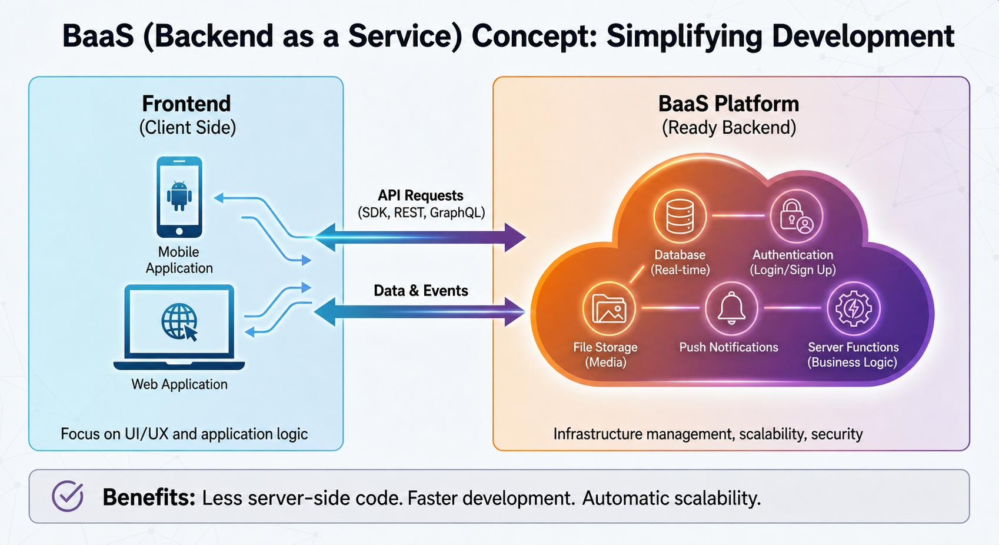
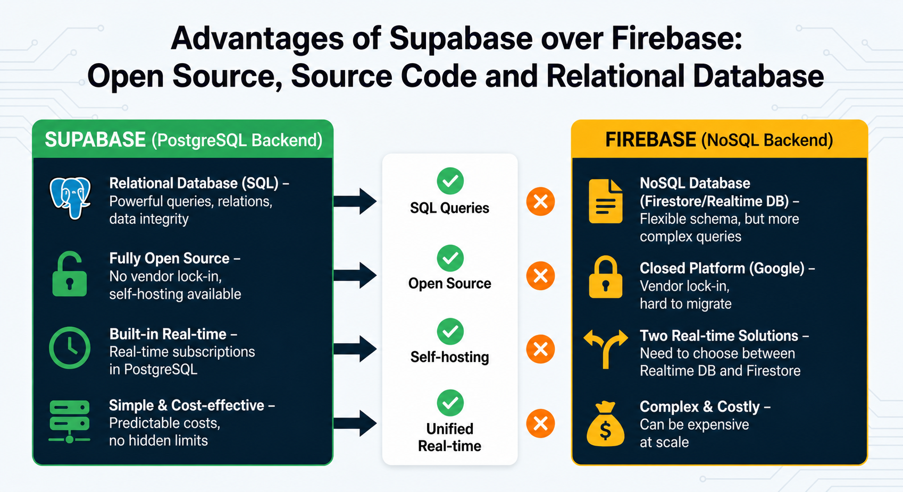

## BaaS — Backend as a Service (using Supabase as an example)

Key features of BaaS:

Authentication and authorization — ready-made solutions for login via email, social networks, OAuth
Database — cloud storage with APIs for CRUD operations, often with real-time capabilities
File storage — upload and store images, videos, and documents
APIs and serverless functions — backend logic without managing servers
Push notifications — send notifications to mobile devices
Analytics — collect data about users and their behavior
Security — built-in access rules and data encryption

